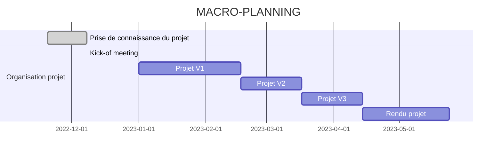

# Projet : Constitution dynamique d’un modèle de performance de voilier par apprentissage

**-Client :** M. GiIles LEPINARD

**-Enseignant référent:** M. GiIles LEPINARD

**-Equipe Dual Boat** 

## Description et objectifs du projet
#### Contexte
Ceci est un contexte
#### Objectifs
Ceci est une description

Les besoins et contraintes du projet sont disponibles sur ce lien du  [backlog](https://docs.google.com/spreadsheets/d/16Uc-_3CkTmRhTnL7Bv5lchy09DF-uITX/edit?usp=sharing&ouid=103043773177032282236&rtpof=true&sd=true)

## Livrables du projet
|**Livrables organisation projet**|**Livrables développement projet**|
|--------|--------|
|   Présentation Kick-off meeting + Compte rendu   |   Processus outillé de génération de modèle de performance (**POA**)    |
|   Compte rendu réunion plan V1 | Application de génération de polaire (**AGP**)|
|Compte rendu réunion plan V2|    Application de prédiction de performance (**APP**)    |
|Compte rendu réunion plan V3  |

## Organisation du projet

### Rôles
### Communication
### Macro-planning

Ceci est un macro planning 

## Développement du projet
Ceci est l'organisation du projet

### Outils de développement
| |**Processus outillé de génération de modèle de performance (POA)**|**Application de  génération de polaire  (AGP)**|**Application de prédiction de performance (APP)**|
|:--------:|:-----------|:-------------|:-----------|
|  **Langage**  | Python    |Python|C ou C#|
|  **Environnement**  |Windows et Linux 64    |Windows et Linux 64|Windows et Linux 64|
|  **Fichiers**  |   readme,config    |readme,config |readme,config |
 
 **Bibliothèques**  
- sklean
- seaborn 
- matplotlib 
- pandas 
- numpy  
- à définir...
